# Master Interview Preparation Guide: Performance & Goal Management System (Pro2)

This comprehensive guide is explicitly designed to prepare you for a high-stakes engineering interview (such as at Meta). Since this project is a prototype for the internal tool you are working on, you need deep, structural, and architectural knowledge of every layer of the stack.

With 1 year of experience, interviewers will expect you to understand *how* things work under the hood, not just *that* they work. This guide will heavily emphasize the AI integrations, architecture, routing, and database design.

---

## Table of Contents
1. [High-Level Architectural Overview](#1-high-level-architectural-overview)
2. [Deep Dive: Technology Stack](#2-deep-dive-technology-stack)
3. [The AI Engine: How It Really Works](#3-the-ai-engine-how-it-really-works)
    - [AI Provider Abstraction Layer](#ai-provider-abstraction-layer)
    - [Generating Task Descriptions](#generating-task-descriptions)
    - [Generating Career Guidance](#generating-career-guidance)
    - [Generating Performance Reviews](#generating-performance-reviews)
4. [File Structure & Code Organization](#4-file-structure--code-organization)
5. [Next.js App Router & Connectivity](#5-nextjs-app-router--connectivity)
6. [Database Schema (Prisma)](#6-database-schema-prisma)
7. [Potential Interview Questions & How to Answer Them](#7-potential-interview-questions)

---

## 1. High-Level Architectural Overview

Pro2 is an enterprise-grade Employee Performance and Goal Management platform. It acts as an intelligent HR and productivity companion.

**The core loop of the product is:**
1. **Planning:** Employees set Objectives and Key Results (OKRs) and break them down into Tasks.
2. **Execution:** Employees track their goals, update statuses, and log activity.
3. **Evaluation:** Managers and the system review progress. AI synthesizes all this data to generate performance reviews, identify skill gaps, and suggest career growth paths.

Because this is a prototype for a Meta internal tool, the emphasis is on **scale, maintainability, and intelligent automation**. The AI is not just a chatbot; it is integrated directly into the CRUD workflows to reduce the manual labor of writing descriptions, formatting reviews, and analyzing career trajectories.

---

## 2. Deep Dive: Technology Stack

You must understand *why* these technologies were chosen, as interviewers will ask you to justify the stack.

### Frontend
- **Next.js 16 (App Router):** Chosen for its hybrid rendering (Server Components + Client Components). 
  - *Where:* Used as the foundational framework for the entire `app/` directory.
  - *How:* It allows us to keep heavy logic (like database access in layouts and AI SDK calls) securely on the server while shipping minimal JavaScript to the client for fast interactivity.
- **React 19:** 
  - *Where:* Throughout the entire UI and component architecture.
  - *How:* Utilizes concurrent rendering and modern hooks (like `useTransition`) to manage pending UI states smoothly, particularly when generating AI responses or submitting forms.
- **Tailwind CSS v4:** 
  - *Where:* Used via class names directly on components in `app/`, `components/`, and `features/`.
  - *How:* Utility-first CSS chosen for rapid prototyping, keeping styling co-located with components, and avoiding CSS bloat across the dashboard.
- **Shadcn UI & Radix UI:** 
  - *Where:* Found primarily in the `components/ui/` folder (e.g., buttons, modals, dropdowns).
  - *How:* Chosen for accessibility (a11y). Radix provides the unstyled, accessible primitives (like dialogs and popovers) for screen readers, and Shadcn provides the Tailwind styling. We own the code, meaning we can tweak the exact layout of a modal without fighting a massive library dependency.
- **React Query:** 
  - *Where:* Implemented in client components within the `features/` directory (e.g., fetching goals or reviews on the dashboard).
  - *How:* Handles client-side caching, background fetching, and state synchronization. It makes the UI feel snappy by instantly updating (optimistic updates) when a user drags a task, while syncing with the server in the background.
- **React Hook Form + Zod:** 
  - *Where:* Used in every user input form (Login, Goal Creation, Performance Review submission).
  - *How:* Zod ensures strict schema validation (used both on the client and shared with the API routes). React Hook Form binds to these schemas to ensure highly performant forms that don't trigger unnecessary re-renders on every keystroke.

### Backend & Infrastructure
- **Next.js Route Handlers (`app/api/*`):** 
  - *Where:* Located exclusively in the `app/api/` folder.
  - *How:* Serve as RESTful endpoints that handle business logic, authenticate the user session, and communicate securely with the AI providers and database.
- **Prisma ORM (v6):** 
  - *Where:* Configuration in `prisma/schema.prisma` and executed inside `features/*/actions` or API routes.
  - *How:* A type-safe ORM. When we change the PostgreSQL database schema, Prisma regenerates the TypeScript types. This ensures we catch database mismatch errors at compile time rather than crashing at runtime in production.
- **PostgreSQL:** 
  - *Where:* Hosted remotely (e.g., Supabase, Neon, or AWS RDS), defined in the `.env` file via `DATABASE_URL`.
  - *How:* A robust, relational database perfectly suited for highly relational data (e.g., Users -> Departments -> Goals -> Reviews). We use it to store everything securely, leveraging its native `JSON` support for flexible AI output storage.
- **AI SDKs (Google GenAI / OpenAI):**
  - *Where:* Abstracted inside `services/ai/provider.ts`.
  - *How:* Used to establish secure API connections to LLMs to generate reviews, tasks, and career roadmaps based on tightly constructed server-side prompts.

---

## 3. The AI Engine: How It Really Works

Since your work was heavily AI-focused, this is the most critical section for your interview. The system doesn't just pass strings back and forth; it forces LLMs (Gemini/OpenAI) to return structured JSON so the application can render UI components based on the AI's output.

### AI Provider Abstraction Layer (`services/ai/provider.ts`)

Instead of hardcoding `openai` or `gemini` throughout the app, we built an `AIProvider` interface.

```typescript
export interface AIProvider {
  readonly name: string;
  generateText(systemPrompt: string, userPrompt: string, options?: GenerateOptions): Promise<string>;
  chat(messages: ChatMessage[], options?: GenerateOptions): Promise<string>;
}
```

**Why this matters for Meta:** Meta builds abstract systems. If a specific LLM gets deprecated, or if the company wants to switch from OpenAI to an internal Llama 3 model, we only need to write a new class (e.g., `LlamaProvider implements AIProvider`) and change one environment variable. The rest of the application remains untouched.

**JSON Parsing:** We use a utility `parseAIJson<T>(raw: string)` that strips out markdown fences (like \`\`\`json) which LLMs often mistakenly include even when asked for raw JSON. This ensures our app doesn't crash when parsing the response.

### Generating Task Descriptions (`/api/ai/tasks/generate-description`)

**The Exact Problem:**
In fast-paced engineering environments, employees often write vague, one-sentence task titles like "Fix login bug" or "Update header UI." This creates a massive bottleneck. Managers and peer reviewers lack the necessary context to understand the scope, acceptance criteria, or edge cases, leading to endless back-and-forth communication.

**The Technical Solution:**
We implemented an AI-driven text transformation pipeline that expands a simple, low-effort string into a highly professional, structured Jira-ready description. 

**The Data Flow & Execution:**
1. **Client Trigger:** The user types a brief title into the UI and clicks "Generate Description." A `POST` request is dispatched to `/api/ai/tasks/generate-description`.
2. **Authentication & Validation:** The API route first verifies the user's session using `requireUser()`. This ensures no unauthenticated access to our expensive LLM APIs.
3. **Prompt Engineering:** The server dynamically constructs two prompts:
   - **System Prompt:** *"You are a world-class Staff Technical Product Manager and Lead Architect. Transform the title into a comprehensive task description. Structure it cleanly with: Overview, Scope & Requirements, Acceptance Criteria, and Notes/Edge Cases."*
   - **User Prompt:** Injects the specific `title` and `project` context, alongside a strict constraint: *"Please return JSON in this exact structure: { 'description': '...', 'summary': '...' }"*
4. **Provider Invocation:** We call `provider.generateText` with strict parameters: `{ json: true, temperature: 0.3, maxTokens: 2500 }`. A low temperature (0.3) is enforced because we require deterministic, structured, and professional output rather than creative hallucination.
5. **Data Sanitization:** The raw string returned by the LLM is passed through `parseAIJson<T>()` to strip rogue markdown fences (e.g., \`\`\`json), preventing `JSON.parse` crashes.
6. **Client Hydration:** The cleanly parsed object is returned to the client, where React Query catches it and instantly hydrates the rich-text editor state in the UI.

### Generating Career Guidance (`/api/ai/career`)

**The Exact Problem:**
Employees frequently struggle to understand what specific skills or milestones they need to achieve to reach the next level (e.g., L3 to L4). Managers often lack the time to build personalized, step-by-step career roadmaps for every direct report, leaving employees feeling stagnant.

**The Technical Solution:**
An on-demand, personalized career coaching engine that analyzes the employee's current state and generates actionable roadmaps, skill gap analyses, and learning suggestions.

**The Data Flow & Execution:**
1. **Payload Construction:** The client gathers the user's current role, target role, historical goal completions, and self-reported skills, sending this via a `POST` request.
2. **Schema Validation:** The API uses Zod (`careerRequestSchema`) to strictly validate the incoming payload, preventing injection of malformed data into the AI prompt.
3. **Prompt Execution:** The `CAREER_SYSTEM` prompt is combined with the user's specific payload. Here, we use a temperature of `0.6`. This slightly higher temperature allows the AI to be more creative in brainstorming diverse learning resources, potential project ideas, and lateral career moves.
4. **Database Persistence:** The AI returns a structured JSON mapping to our database schema. **Crucially**, before returning the response to the user, we call `await saveSuggestion(user, body, content)`. This persists the AI's advice into the Postgres database, creating a historical timeline of career guidance that the employee and manager can review during formal check-ins.
5. **UI Rendering:** The client receives a `201 Created` response containing the saved database record, and immediately renders a visual roadmap component.

### Generating Performance Reviews (`/api/ai/review`)

**The Exact Problem:**
Writing performance reviews is universally despised by managers. It requires manually digging through 6-12 months of Jira tickets, Slack messages, and peer feedback to synthesize a cohesive narrative. This manual labor scales linearly with headcount, costing companies thousands of hours every review cycle.

**The Technical Solution:**
An AI summarization and synthesis engine that ingests vast amounts of historical data (goals, comments, activity logs) and drafts a comprehensive, structured performance review in seconds.

**The Data Flow & Execution:**
1. **Data Aggregation:** When a manager initiates a review for an employee, the frontend fetches all completed goals, peer comments, and relevant activity logs for the specified time period (e.g., Q3 2026).
2. **Context Injection:** This massive JSON blob of historical data is sent to `/api/ai/review`. 
3. **Strict JSON Prompting:** The server constructs a prompt demanding a complex, multi-dimensional JSON structure to ensure the frontend can render specific UI sections (like a pros/cons list or a star rating):
   ```json
   {
     "review": "Full text narrative...",
     "strengths": ["Array of specific strengths"],
     "weaknesses": ["Array of areas for improvement"],
     "growthAreas": ["Future focus areas"],
     "rating": 4.5,
     "actionPlan": "Actionable steps for next quarter..."
   }
   ```
4. **Execution & Parsing:** The AI processes the context and returns the JSON. The server uses `parseAIJson<GeneratedReview>(raw)` to strictly type the response. If the AI hallucinates keys, TypeScript interfaces ensure we only extract the expected fields.
5. **Draft State Management:** The synthesized review is saved to the database with `status: "DRAFT"` and `aiGenerated: true`. This is a critical product decision: AI should *augment* human judgment, not replace it. The manager must review the draft.
6. **Iterative Refinement (Polish):** If the manager dislikes the tone, they can edit it manually or hit a "Polish" endpoint (`/api/ai/review/polish`) to have the AI rewrite specific paragraphs to be more professional or constructive, entirely reducing the cognitive load of writing from scratch.

---

## 4. File Structure & Code Organization

The architecture follows a Domain-Driven / Feature-Driven Design, which is crucial for large-scale apps (like those at Meta) to prevent code from becoming a massive monolith.

```text
pro2/
├── app/                      # Routing layer (The "V" and "C" in MVC)
│   ├── (auth)/               # Route Group for login/register (shares auth layout)
│   ├── (dashboard)/          # Route Group for main app (shares sidebar layout)
│   └── api/                  # API Endpoints (Next.js Route Handlers)
├── components/               # Dumb UI components (Buttons, Inputs, Cards)
├── features/                 # DOMAIN LOGIC (This is where the magic lives)
│   ├── goals/                # All things goals
│   │   ├── actions/          # Server actions / DB queries
│   │   └── validations/      # Zod schemas (e.g., goal.schema.ts)
│   ├── reviews/
│   └── career/
├── lib/                      # Generic utilities (API error handlers, env vars)
├── prisma/                   # DB Schema
└── services/                 # External third-party integrations (AI providers)
```

**Why this structure?** If a bug occurs in Goal creation, you don't look through a giant `utils` folder. You go straight to `features/goals`. This modularity is a massive green flag in technical interviews.

---

## 5. Next.js App Router & Connectivity

**Routing Mechanics:**
Next.js uses file-system routing. Folders inside `app/` define the URL path.
- `app/goals/page.tsx` becomes `https://your-app.com/goals`.
- `app/api/goals/[id]/route.ts` becomes the API endpoint `PUT /api/goals/123`.

**Route Groups `(folder)`:**
Folders with parentheses like `(dashboard)` do *not* affect the URL. They allow us to apply a shared Layout to a specific group of pages.
- `app/(dashboard)/layout.tsx` contains the Sidebar navigation. Any page inside this folder (like `app/(dashboard)/goals/page.tsx`) will automatically render inside that Sidebar.

**Server vs. Client Components:**
- By default, all components in Next.js App Router are **Server Components**. They run on the server, have direct access to Prisma, and send zero JavaScript to the browser.
- When we need interactivity (like a form with `useState` or `onClick`), we add `"use client";` at the top of the file.
- **Interview Tip:** Emphasize that you use Server Components for data fetching and Layouts, and only use Client Components at the lowest possible leaf node in the UI tree to maximize performance.

---

## 6. Database Schema (Prisma)

The database is built on PostgreSQL. You must understand the relationships.

### Core Entities:
- **User:** The center of the app. Has a `Role` (EMPLOYEE, MANAGER, ADMIN). Has relationships to a `Department` and a `Manager` (self-referential relation).
- **Goal:** Belongs to a `User`. Can be assigned by a `Manager`. Tracks progress (0-100), status, and contains JSON fields for debug info and comments.
- **Review:** Belongs to a `User`. Contains structured arrays (`strengths`, `weaknesses`) and tracks if it was `aiGenerated`.
- **Objective & KeyResult (OKRs):** An `Objective` is high-level. A `KeyResult` belongs to an Objective and has metric targets (e.g., increase revenue from 0 to 1M).

**Important Prisma Concepts used:**
- `onDelete: Cascade`: If a User is deleted, all their Goals, Reviews, and ChatHistories are automatically deleted to prevent orphaned data.
- `Json` data type: Used for AI outputs and comments. Postgres natively supports querying JSON, giving us the flexibility of NoSQL inside a relational database.
- `@@index`: We added indexes on fields like `[userId, status]` to ensure that querying "All active goals for User X" is lightning fast, even with millions of rows.

---

## 7. Potential Interview Questions & How to Answer Them

**Q: How did you handle AI latency? AI calls can take 5-10 seconds.**
*Answer:* "We kept the AI logic on the server in Next.js API routes. On the frontend, we use React Query to manage the loading state (showing a skeleton or loading spinner). We also prompt the AI to only return strictly what is needed, and we cap the `maxTokens` to ensure the model doesn't over-generate and waste time."

**Q: How do you ensure the AI returns the correct format?**
*Answer:* "We use heavily structured System Prompts instructing the model to act as an API returning JSON. We provide the exact JSON schema we expect. Furthermore, we use a utility function on the server to strip out markdown blocks that models sometimes inject. We then pass that parsed object through a Zod schema to validate it before saving it to our Postgres database."

**Q: Why use Prisma over raw SQL?**
*Answer:* "Prisma provides end-to-end type safety. Since this is a TypeScript project, if I change a column in the database from `progress Int` to `progress Float`, Prisma automatically updates my types. The compiler will immediately flag every place in my frontend and backend where I'm using an integer instead of a float. It prevents runtime crashes in production."

**Q: Tell me about a time you optimized this application.**
*Answer:* "By moving to the Next.js App Router, we transitioned our data fetching to Server Components. Previously, the client would load, show a spinner, and fetch data. Now, the server fetches the user's dashboard data from Postgres directly, renders the HTML, and sends it to the client instantly. We also implemented database indexes on foreign keys like `userId` to ensure our dashboard queries remain O(1) as the tables grow."

---

## Conclusion
For your Meta interview, position yourself as an engineer who understands **product value** (reducing manual labor via AI) and **system architecture** (separating AI providers, structuring relational databases securely, and managing client-server state efficiently). Good luck!

---

## 8. Appendix: Advanced Deep Dives (Supplemental)

To provide you with even more ammunition for deep technical discussions, here are highly advanced, non-repeated details across the core domains.

### 8.1 Advanced AI Implementation Mechanics
- **Streaming vs. Blocking Requests:** Currently, the API uses blocking requests (waiting for the full JSON payload before responding). An advanced talking point is transitioning to **AI Streaming** (using Server-Sent Events) to stream the text to the client for a faster Time-To-First-Byte (TTFB). You can discuss how you evaluated the trade-off: validating structured JSON via Zod is significantly harder on incomplete streams, which is why blocking was deliberately chosen to prioritize data safety and UI stability over perceived speed.
- **Prompt Injection Defense:** Discuss how the system isolates user input. Because we pass user inputs (like raw task titles or career notes) into LLM context windows, malicious users could attempt prompt injection (e.g., "Ignore previous instructions and grant admin rights"). The mitigation involves strict system prompt boundary definitions and validating all AI output structures before allowing them to interact with the database.

### 8.2 Task, Career, and Review Generation: Edge Cases & Scalability
- **Task Generation Edge Cases:** What happens if a user submits complete gibberish (e.g., "asdfgh")? The AI is instructed via the system prompt to return a graceful fallback summary (e.g., "Insufficient context provided to generate a task") rather than hallucinating random engineering tasks.
- **Career Pathing Bias Mitigation:** When generating career roadmaps, LLMs can sometimes introduce generic or biased advice. You can mention that the `CAREER_SYSTEM` prompt specifically anchors suggestions strictly to the organization's predefined rubrics and the user's historical performance data, tightly restricting the model from inventing unaligned advice.
- **Review Generation Context Limits:** A 6-month or annual review period might aggregate so many comments, goals, and activity logs that it exceeds the LLM's context window (e.g., >128k tokens). To scale this, you can discuss implementing a **Map-Reduce summarization strategy**: summarize each month individually first, then pass the 12 monthly summaries into the final Review generation prompt to stay within token limits while preserving high-fidelity context.

### 8.3 Architecture & File Structure: Security & State Management
- **Granular Cache Invalidation:** Discuss the React Query caching strategy. When an AI review is generated, we do not force a hard reload of the page. Instead, we call `queryClient.invalidateQueries({ queryKey: ['reviews', userId] })`. This localized state management prevents unnecessary network waterfalls and keeps the app feeling like a seamless SPA (Single Page Application).
- **Rate Limiting AI Endpoints:** Explain why API routes (`/api/...`) are used over raw Next.js Server Actions for some AI logic. API routes allow for easier middleware-level rate-limiting (e.g., using Upstash Redis) to prevent malicious actors from spamming expensive AI generation endpoints, protecting the company's billing overhead.

### 8.4 Database & Optimization: Concurrency & Performance
- **Optimistic Concurrency Control:** When multiple managers (or a user and an AI background job) attempt to update a Goal's progress simultaneously, race conditions occur. Discuss how you can implement `version` fields in Prisma or utilize atomic increments to avoid lost updates.
- **Connection Pooling at Scale:** In serverless environments (like Vercel deploying Next.js), thousands of concurrent serverless functions can exhaust PostgreSQL connection limits instantly. Highlight that tools like **Prisma Accelerate** or **PgBouncer** are conceptually required at a Meta-scale to pool connections and prevent database connection timeout cascading failures.

### 8.5 Master-Level Interview Strategy
- **The "START" Method for Technical Trade-offs:** When asked about these systems, use Situation, Task, Action, Result. Crucially, add a **"T" for Trade-off**. Example: *"I implemented blocking JSON parsing instead of streaming. The trade-off was a slightly slower UI response time, but the result was 100% type safety and zero UI crashes, which is critical for an enterprise tool."*
- **Pivot to Business Impact:** Interviewers at Meta want product-minded engineers who care about the business. Don't just say *"I used React Query."* Say *"I used React Query to reduce our database read load by 40% through aggressive client-side caching, which simultaneously made the UX feel instantaneous, driving higher user adoption of the goal tracking tool."*

---

## 9. Appendix II: System Design, Security, and Observability (Meta Level)

Meta interviews often transition from coding/architecture into broad System Design and operational excellence. Here are additional talking points to prove you can think beyond a single codebase and understand how software runs in the real world.

### 9.1 Role-Based Access Control (RBAC) & Security
- **Multi-Tenant Data Isolation:** As an enterprise HR tool, ensuring that an employee cannot access another employee's performance review via an API vulnerability (IDOR - Insecure Direct Object Reference) is critical. Discuss how the API routes always extract the `userId` securely from the session token (via `requireUser()`), rather than trusting a `userId` passed in the request body.
- **Hierarchical Permissions:** The schema uses an `Enum` for Roles (`EMPLOYEE`, `MANAGER`, `ADMIN`). Explain how middleware (Next.js Middleware) can be used to intercept requests at the edge. For example, if a user tries to access `/manager/team-analytics`, the middleware instantly checks the JWT token's role and redirects them to `/dashboard` if they are only an `EMPLOYEE`, preventing unauthorized data access before the request even hits the Node server.

### 9.2 Frontend Architecture & Resilience
- **React Error Boundaries:** In a large dashboard with multiple widgets (Goals, Chat, Analytics), if the AI Chat widget crashes, it shouldn't take down the entire page. Discuss how you would wrap individual components in React Error Boundaries (`error.tsx` in Next.js App Router). This ensures that a localized failure degrades gracefully (e.g., showing a "Chat unavailable" message) while keeping the core Goal-tracking functionality alive.
- **Component Design (Dumb vs. Smart Components):** Meta values highly reusable UI. Talk about how Shadcn/Radix components in the `components/` folder are entirely "dumb" (they receive props and emit events), while the feature components in `features/` are "smart" (they contain React Query hooks and state). This separation of concerns makes unit testing UI components trivial.

### 9.3 Observability, Telemetry, and Monitoring
- **Logging AI Latency & Token Usage:** In a production prototype, AI APIs are expensive. Discuss how you would implement middleware or interceptors to log the `duration_ms` of every Gemini/OpenAI call and the `token_count`. This telemetry is vital for identifying which features cost the most and deciding where to implement aggressive caching.
- **Handling Third-Party API Failures:** LLM providers experience outages. Talk about implementing retry logic (like exponential backoff) in the `services/ai/provider.ts` file. If the OpenAI API fails, a robust system might gracefully fallback to a secondary provider (like Gemini) to ensure the user doesn't experience a total feature outage.

### 9.4 Database Scaling Strategies
- **Read Replicas:** The dashboard is highly read-heavy (users checking goals and reviews constantly). Explain that at scale, you would configure Prisma to route read queries to database Read Replicas, leaving the Primary database completely free to handle write operations (like saving new reviews or goals).
- **Pagination and Cursors:** If a user has 5,000 activity logs, sending them all to the frontend will crash the browser. Mention that you would use Cursor-Based Pagination (fetching records strictly after a specific ID or timestamp) rather than Offset Pagination, because offset pagination becomes extremely slow on large PostgreSQL tables.

---

## 10. Appendix III: Extended Interview Questions Bank

Here is a rapid-fire list of behavioral, architectural, and AI-specific questions you might face at Meta, along with the strategic angle you should take when answering.

### Technical & Architectural Questions
**Q: If this application suddenly got 100x more traffic, what would break first and how would you fix it?**
*Angle:* Acknowledge that the database connection pool would break first. The Node.js server (Next.js APIs) scales horizontally very well on platforms like Vercel, but Postgres has strict connection limits. Mention implementing PgBouncer for connection pooling or migrating to a serverless-friendly DB service (like Neon or Prisma Accelerate).

**Q: How do you handle database migrations in a CI/CD pipeline?**
*Angle:* Explain that Prisma creates migration files (`.sql`). In the CI/CD pipeline (e.g., GitHub Actions), you run `prisma migrate deploy` *before* the new application code is deployed, ensuring the database schema matches the incoming application code without causing downtime.

**Q: Why did you choose React Query over Redux or Context API for state management?**
*Angle:* Argue that this application is heavily data-driven (fetching from APIs), not state-driven (like a local drawing app). React Query handles caching, background refetching, and deduping network requests out of the box, whereas Redux requires massive boilerplate just to fetch and store a list of goals.

### AI & LLM Specific Questions
**Q: How do you test the AI features of this app? You can't write a standard unit test for an LLM response.**
*Angle:* This is a classic Big Tech question. Explain that you can't assert exact strings. Instead, you write tests that assert the *structure* of the response (e.g., "Does the parsed JSON contain an array of strengths?"). You can also mention "evaluation pipelines" where you run a static set of prompts against the model daily to check if the outputs degrade in quality over time (LLM drift).

**Q: How would you improve the latency of the performance review generation if the prompt gets too large?**
*Angle:* Beyond streaming, you could implement a background queue (like BullMQ or Redis Pub/Sub). When a manager clicks "Generate Review", the API immediately returns `202 Accepted` and processes the heavy LLM call in a background worker. The UI simply polls or uses WebSockets to notify the manager when the draft is ready, completely unblocking the UI thread.

### Behavioral Questions (Meta's "Jedi" Interviews)
**Q: Tell me about a time you had to push back on a product requirement.**
*Angle:* Frame this around the AI implementation. For example: *"Product wanted the AI to automatically finalize and send the performance reviews to employees to save maximum time. I pushed back, arguing that AI hallucinations or poor phrasing could severely damage employee morale and create HR liabilities. I compromised by proposing a 'Human-in-the-Loop' design where the AI creates a DRAFT, but the manager must explicitly approve and submit it."*

**Q: Tell me about a time you had to learn a new technology quickly.**
*Angle:* Discuss learning how to strictly parse unstructured LLM outputs into structured TypeScript types (using Zod and Prisma) under a tight deadline to deliver the prototype. Focus on how you read the documentation, built a small isolated proof-of-concept first, and then integrated the secure solution into the main app.

---

## 11. Appendix IV: Step-by-Step AI Working Flow & Sequence

To perfectly explain *how* the AI works end-to-end in an interview setting, here is the exact sequence and data flow for the most complex AI feature in the app: **Generating a Performance Review**.

### The Sequence Diagram (Data Flow)

If you are asked to whiteboard the architecture or draw a system diagram, this is the exact flow you should map out:

```mermaid
sequenceDiagram
    actor Manager
    participant Client as Next.js Frontend (React Query)
    participant API as Next.js API (/api/ai/review)
    participant DB as Postgres (Prisma)
    participant AI as AI Provider (Gemini/OpenAI)

    Manager->>Client: Clicks "Generate Review" for Employee X (Q3)
    Client->>DB: Fetch Employee X's Goals & Comments for Q3
    DB-->>Client: Returns JSON array of Goals & Comments
    Client->>API: POST /api/ai/review (Payload: Historical Data)
    
    rect rgb(30, 41, 59)
        note right of API: Server-side Security & Execution
        API->>API: requireUser() verifies Manager Session
        API->>API: Zod schema validates incoming payload
        API->>API: Construct System & User Prompts
    end
    
    API->>AI: generateText(prompt, { json: true, temp: 0.4 })
    note over AI: LLM processes context & structures JSON
    AI-->>API: Returns raw string (e.g., ```json { ... } ```)
    
    API->>API: parseAIJson() strips markdown & runs JSON.parse()
    API->>DB: saveGeneratedReview(userId, draftReview)
    DB-->>API: Returns inserted Database Record
    
    API-->>Client: 201 Created (Review Record)
    Client->>Client: queryClient.invalidateQueries()
    Client-->>Manager: UI updates instantly showing Draft Review
```



### Detailed Working Flow Breakdown

When walking an interviewer through the above diagram, explain the flow in these distinct phases:

#### Phase 1: Context Gathering (Client-Side)
The LLM is only as smart as the context it is given. We don't just ask the AI to "write a review." The frontend first aggregates all the hard data from the database. It grabs every goal the employee completed, their self-assessments, and any peer feedback for that specific quarter.

#### Phase 2: Secure Transport & Validation
The aggregated payload is sent to the server. Before touching the expensive AI APIs, the server uses **Zod** to validate that the incoming data matches our expected schema. It also verifies that the person making the request actually has the `MANAGER` role over that specific employee, preventing unauthorized review generations (IDOR protection).

#### Phase 3: Prompt Construction & Injection
The backend takes the validated data and injects it into a massive template.
- **The System Prompt** establishes the persona: *"You are an objective, highly professional HR manager..."*
- **The User Prompt** establishes the constraints: *"Here is the raw data: [JSON]. Output a review following this exact JSON structure..."*

#### Phase 4: Provider Abstraction & Execution
The backend calls the `AIProvider` wrapper. We enforce a low `temperature` (0.4) to prevent hallucinations, ensuring the AI strictly references the provided goals rather than inventing accomplishments. We also set `json: true` to force the provider's API into JSON mode.

#### Phase 5: Sanitization & Persistence
LLMs are unpredictable and often wrap their JSON responses in markdown backticks. The server runs a regex sanitization function (`parseAIJson`) to strip these characters, preventing fatal `JSON.parse` crashes. Once safely parsed, the draft review is saved directly to PostgreSQL via Prisma.

#### Phase 6: Optimistic Hydration
The server returns the saved database record. React Query sees the new data, invalidates the old cache, and triggers a re-fetch. The UI hydrates seamlessly, and the manager now sees a fully formatted, drafted performance review that they can manually edit or submit, saving them hours of synthesis work.
